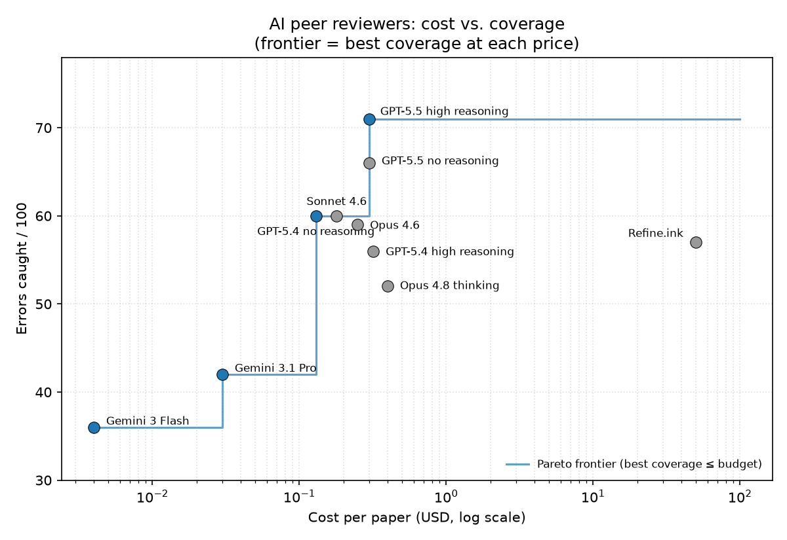

# How to measure an AI peer reviewer

AI peer-review tools are everywhere now: Refine.ink, Reviewer3, Paper Wizard, or just a raw API call to Claude or GPT. They all promise to catch the methodological errors in your manuscript, and nobody can tell you which ones work, because peer review has no answer key. Two reviewers reading the same paper flag different problems and disagree about which ones matter. You can't score a reviewer without knowing the right answers.

So we made answer keys: take real published papers, plant errors you fully understand, run the reviewers blind, and count who catches what. This piece describes the first one we built. Ten psychology papers, 100 hand-inserted errors, every major AI system scored on the same set. The psychology part is a demonstration. What I care about is the recipe, which gives you a working benchmark for any field as long as you ground it in how that field actually goes wrong.

The psychology run does say something on its own: the newest frontier model did about as well as or better than the commercial tools on the errors we could score. I wouldn't over-read that. It's one field and one artificial set of errors, and the mistakes that matter in an economics or physics paper look nothing like these. The more useful thing the benchmark surfaced sits underneath the leaderboard: generating candidate problems is now cheap, and verifying them is the hard part nobody has solved.

---

## The idea: plant errors you understand, then measure who finds them

Planting errors turns a subjective question ("is this a good review?") into a measurable one: recall against ground truth. The hard part is the errors themselves. Testing whether AI can spot a typo or a missing p-value is pointless, since any tool can. We wanted errors you need methodological understanding to catch, the kind of thing a good Reviewer 2 flags because they know *why* a particular design choice matters.

That constraint had a consequence that surprised us: most of the modified papers are *shorter* than the originals. Instead of inserting nonsense, we mostly removed the safeguards that protect a paper's conclusions — a deleted sentence here, a swapped denominator there. The paper still reads fine. You just can't trust the findings anymore.

---

## Methods

### The papers

We picked 10 open-access psychology papers that span most of what the field looks like methodologically. All CC-BY 4.0, all with .docx manuscripts on OSF, kept unmodified as ground truth.

| # | Topic | Design |
|---|-------|--------|
| 1 | How political ideology predicts environmentalism over 5 years | Cross-lagged panel (N=22,974) |
| 2 | Does learning about the identifiable victim effect reduce it? | Between-subjects experiment |
| 3 | Can technology improve through cultural transmission without understanding? | Experimental (physical wheel optimization) |
| 4 | Can text messages predict suicide risk in real time? | Within-subjects, 189,478 text messages |
| 5 | Does self-esteem predict Facebook self-disclosure? | Collaborative replication meta-analysis |
| 6 | Does patient incivility cause nurses to become uncivil back? | 4-wave longitudinal diary study |
| 7 | Do illusory memories arise in short-term memory? | 4 within-subjects experiments |
| 8 | Can you inoculate witnesses against misinformation? | Registered report, between-subjects |
| 9 | Is "porn addiction" actually moral incongruence? | Registered report, nationally representative survey |
| 10 | Do readers use statistical patterns in English spelling? | Eye-tracking + corpus analysis |

Cross-lagged panels, RCTs, meta-analyses, diary studies, registered reports, eye-tracking, corpus methods. If an AI reviewer only works on one kind of paper, this will find out.

### The taxonomy: 10 kinds of problem

Each paper got exactly one error per category, so 10 errors × 10 papers = 100, every category represented equally:

1. **Statistical errors** — wrong test statistics, inconsistent values, incorrect parameters
2. **Methodological design** — missing controls, removed safeguards, broken counterbalancing
3. **Construct validity** — measures that don't match constructs, swapped operationalizations
4. **Causal inference** — removed confound checks, inappropriate causal claims
5. **Internal consistency** — contradictions between sections, numbers that don't add up
6. **Reporting completeness** — missing details needed to evaluate or replicate the study
7. **Generalizability** — changed samples, removed screening criteria, overclaims
8. **Theoretical/conceptual** — misapplied frameworks, swapped predictions, wrong mechanisms
9. **Analytic flexibility** — removed pre-registration details, admitted post-hoc model selection
10. **Attrition/missing data** — concealed dropout, changed handling procedures

The taxonomy comes from a larger project (it feeds a replication-prediction model we're building), but its job here is simpler: it makes sure the errors cover the full methodological surface instead of one favorite failure mode.

### Difficulty tiers

We rated every error on how hard it is to catch. This turns out to be the spine of the whole result.

- **Tier 1 — internal contradictions (13 errors).** Spottable from adjacent text: numbers that don't add up, a claim that contradicts data in the same paragraph. Any competent system should catch these.
- **Tier 2 — needs methodological knowledge (63 errors).** Why autoregressive controls matter, why within-subjects breaks a particular manipulation, why a specific confound check is needed for a specific design. This is where most of the variation between systems lives.
- **Tier 3 — notice what's *missing* (24 errors).** You have to generate an expectation of what *should* be in the paper and register its absence: a deleted transformation, a removed safeguard, a justification a specialist would expect to see and doesn't. This is the hardest tier, and it turns out to be everyone's ceiling.

Tier 1 establishes a floor. Tier 2 separates the models. Tier 3 tests whether a system can reason about methodology from first principles rather than scanning the text for red flags.

### What the errors actually look like

A few examples across the range. All of these are real entries in the ground-truth file.

**Tier 1 — Paper 4 (Suicide Risk): safety check reversed.** The original reports that participants' desire to die *decreased* from pre (M=0.82) to post (M=0.61), a safety check confirming the study didn't cause harm. We changed the post mean to 1.03. Now the numbers show an increase while the text still says "decreased slightly." The numbers go up, the words say down. Any careful reader should catch this.

**Tier 1 — Paper 10 (English Spelling): formula denominator swapped.** The paper distinguishes *diagnosticity* (does -OUS predict "adjective"? that's P(category|spelling)) from *specificity* (for adjective-sounding words, is -OUS the go-to spelling? that's P(spelling|category)). We swapped the denominator in the diagnosticity formula so it now computes specificity. The definition still says "diagnosticity"; the math does something else. The paper's entire theoretical contribution rests on these being different things.

**Tier 1 — Paper 2 (Identifiable Victim Effect): between-subjects → within-subjects.** Participants are randomly assigned to see an identifiable or a statistical victim. We changed "between-subject" to "within-subject," which is impossible here: the intervention condition *teaches* people about the effect, and once you know it you can't un-know it. The change also makes the ANOVA degrees of freedom in the tables wrong for a repeated-measures design, which is what makes this Tier 1 — you can catch it from the table before you ever reason through why within-subjects can't work.

**Tier 2 — Paper 6 (Nurse Incivility): removed autoregressive controls.** This paper argues that experiencing patient incivility causes nurses to become uncivil themselves, through negative emotions and compassion fatigue, using a 4-wave longitudinal design with autoregressive controls: each variable at time T adjusted for its own value at T-1. That adjustment is what makes the cross-lagged paths interpretable as *change*. We removed the autoregressive specification. The paper still says "mediation approach" and reports the same results. It reads fine. But now you can't distinguish "incivility causes incivility" from "some nurses are chronically uncivil and chronically mistreated, and both traits are stable."

**Tier 2 — Paper 8 (Memory Conformity): reversed intervention timing.** This registered report tests whether you can reduce eyewitness memory conformity by intervening *after* participants are exposed to misinformation from a co-witness but *before* their individual memory test. That placement is the whole point of the study; it tests retrieval-stage resistance rather than encoding prevention. We changed "after" to "before" the collaborative recall phase. Now the intervention tests a completely different cognitive mechanism, and the framework motivating the study no longer applies. But "before" reads just as naturally as "after."

**Tier 2 — Paper 9 (Moral Incongruence): inflated the SESOI.** The paper argues moral incongruence is unique to pornography by showing the effect is near-zero for other behaviors, using equivalence testing. The "smallest effect size of interest" should be the smallest observed effect (δ=.11), a strict bar. We changed it to the largest (δ=.27), which makes the tests trivially easy to pass. To catch it you'd have to cross-reference the SESOI against effect sizes reported elsewhere in the paper and realize .27 is the wrong boundary.

**Tier 3 — Paper 5 (Facebook Meta-Analysis): deleted the Fisher z-transformation.** Meta-analysis of correlations requires transforming r to Fisher's z before pooling, because the sampling distribution of r is skewed. We deleted the one sentence mentioning this step. The paper still uses the metafor package, still reports r values, still looks like a competent meta-analysis. A reviewer would have to independently think: wait, did they transform r to z? Catching it means noticing something that should be there and isn't, which is a different skill from seeing something wrong on the page.

**Tier 3 — Paper 3 (Cultural Evolution): deleted one sentence about failed wheels.** The experiment measures whether wheel speed improves across generations. Some wheels didn't make it down the ramp at all. The original says: "Wheels that did not go down were attributed a speed of 0." Without that sentence, you can't tell whether "speed increased" means wheels got faster or there were just fewer total failures. We deleted it. The results look the same and nothing visible is wrong. You just can't evaluate the claim anymore.

### Scoring: the hard part

We send each modified paper to an AI reviewer and get back a list of flagged issues. The problem: how do you decide a finding matches a planted error when they use completely different words?

We use an LLM judge (Claude Haiku 4.5) with prompt caching. For each paper, all 10 ground-truth errors are loaded as a cached prefix, and each reviewer finding becomes a cheap incremental query: which of these 10 errors, if any, does this finding identify? The judge has to determine that the finding caught the specific problem, not just commented on the same topic. Each error can be claimed once; the first finding to claim it wins.

The judge had to be made strict. Early versions matched on topic overlap — a model commenting on robustness checks that *were present* in a paper got credited for "robustness check removed." We tightened the prompt to require identifying the specific defect rather than discussing the topic area. That one change matters more than it sounds. It's the difference between a benchmark and a vibe.

In fact, the scoring method moved the numbers more than the models did. We went through three versions:

- **Fuzzy string matching:** 82–94/100. Nearly useless. Roughly 35 points of false credit, and producing more findings mechanically raised your score.
- **LLM judge with a pre-filter:** 49–60/100. Better, but the pre-filter silently dropped valid matches whenever a model described an issue in different language.
- **Cached judge, no pre-filter, strict prompt:** the version we kept. Every finding gets judged against all 10 errors at once, and the spread it produces separates the models cleanly.

If you take one methods lesson from this piece, take that one: most "AI does X" claims die on the scoring details.

### Keeping the numbers honest

We report raw catches out of 100, plus how many findings each system produced to get there. No adjustment, no curve. The findings count is the precision lens: 30 catches from 125 findings is a different animal from 66 from 704, and printing the two numbers side by side shows it.

We also ran each LLM three times. Variance ranges from ±1 (GPT-5.4, nearly deterministic) to ±18 (Opus with extended thinking), so single-run numbers come with a caveat. And we hand-checked 20 random judge decisions, all accurate. That's a small calibration set, and it's listed in the limitations, but it's enough to trust the direction.

### Keeping the commercial comparison fair

Part of the motivation was a concrete question: the AI peer-review startups charge real money (Refine.ink is ~$50 a review) while a raw API call costs cents, so is the premium buying better error detection, or the product around the model?

To compare fairly, we fed the commercial tools the *same content* the LLMs saw — the extracted manuscript text, rendered to PDF — so we're measuring review ability rather than who has the better document parser. The tradeoff: the tools see reflowed text, with no original page layout and no intact tables. Refine and Reviewer3 accept PDFs natively, and their real products might do better on a publisher PDF. Read their numbers as a floor.

One more thing cuts the other way. The prompt we gave the LLMs names all ten categories and lists example issue types ("undisclosed researcher degrees of freedom," "missing pre-registration details," and so on). It tells the model what to look for. The commercial tools got no such scaffolding; they run their own fixed pipeline. So the LLMs had a hint sheet the tools didn't, and we tested what the hint is worth by re-running the models on an open-ended prompt with no categories. For most of the frontier it barely registers: Opus 4.8 lost one catch (52 → 51), the Claude 4.6 and Gemini models between zero and three. The exception was GPT-5.4, which lost thirteen (60 → 47). So we checked its successor directly, and GPT-5.5, the leader, dropped five: 71 with the categories, 66 without.

That's a real but modest thumb on the scale, and two things hold up under it. GPT-5.5 still tops the table on the open prompt — 66 is clear of GPT-5.4's 60 and Refine's 57. And its defining advantage, the 13-of-24 score on the "notice what's missing" tier, is identical with or without the hint sheet; the entire five-catch drop is in the middle tier. So the lead is mostly capability, with a few points of prompt on top.

---

## Results

### The leaderboard

| System | Caught /100 | Findings | Cost/paper | Cost/error |
|--------|:---:|:---:|:---:|:---:|
| **GPT-5.5 (high reasoning)** | **71** | 512 | $0.30 | $0.042 |
| GPT-5.5 (no reasoning) | 66 | 704 | $0.30 | $0.045 |
| GPT-5.4 (no reasoning) | 60 | 421 | $0.13 | $0.022 |
| Claude Sonnet 4.6 | 60 | 356 | $0.18 | $0.030 |
| Claude Opus 4.6 | 59 | 310 | $0.25 | $0.042 |
| **Refine.ink** | 57 | 305 | ~$50 | ~$8.77 |
| GPT-5.4 (high reasoning) | 56 | 278 | $0.32 | $0.057 |
| Opus 4.8 (thinking) | 52 | 227 | $0.40 | $0.077 |
| Gemini 3.1 Pro | 42 | 203 | $0.03 | $0.007 |
| Gemini 3 Flash | 36 | 200 | $0.004 | $0.001 |
| **Reviewer3 (journal mode)** | 30 | 125 | subscription | n/a |

*Cost/error = the price of the ten-paper run divided by errors caught.*

(The ±thinking variants of Sonnet and Opus sit in the 47–55 band; the full table is in the appendix. GPT-5.4 high-reasoning is a single run — a quota limit cut its repeat runs short — so it has no reliability range, but its main number is complete and comparable.)

Four things stand out.

The frontier jumped. GPT-5.5 with high reasoning is the clear #1 at 71, and it posts the best score anyone has on the hardest tier: 13 of the 24 "notice what's missing" errors, the tier that had been everyone's ceiling. Reasoning is what did it. On GPT-5.4, reasoning did nothing (60 without, 56 with). On GPT-5.5 it's the difference between the middle of the table and first place.

Volume isn't coverage. GPT-5.5 without reasoning is a firehose, 704 findings, more than anything else we ran, and it catches 66. GPT-5.5 with reasoning writes fewer (512) and catches more (71). Reviewer3 catches 30 from just 125. A system's findings count tells you about its verbosity, not its coverage, which is why we print it next to the catch count.

Opus 4.8 put its skill behind thinking. Without thinking it's terse and conservative, 47 caught from 279 findings, a regression from Opus 4.6. With thinking it finds more from fewer: 52 from 227. The capability is there; it only shows up when the model is allowed to think.

And cost: the best system runs about 30 cents a paper, four cents per error caught. Hold onto that number for when we get to the tools that charge $50.

### The cost frontier

Plot price against coverage and the sub-dollar models trace the frontier — Gemini Flash, Gemini Pro, GPT-5.4, GPT-5.5 — each buying a bit more coverage for a bit more money, up to GPT-5.5 at 71 errors for thirty cents.

Two kinds of system sit off that frontier. A few models are mildly dominated: Opus 4.8 thinking catches 52 for forty cents where GPT-5.4 catches 60 for thirteen. And then there's Refine, which isn't so much off the frontier as in a different county. At ~$8.77 per error caught against four cents for GPT-5.5, it costs roughly 200× more per catch and finds fewer in total. On cost-efficiency alone it barely fits on the chart. (The earlier caveat holds — Refine catches errors the models don't, so cost-per-planted-error understates it. But 200× is a lot of understatement to make back.)

### The commercial tools

**Refine.ink.** It behaves like a thorough LLM: ~305 findings across the ten papers, 57 caught. That's mid-pack on the raw count and efficient with it, about as many catches as GPT-5.4 (60) from fewer flags. Its weakness is the universal one in sharper form: 5 of the 24 absent errors, where GPT-5.4 got 11. Strong on everything present-and-wrong (design changes, swapped constructs, contradictory numbers), nearly blind to deletions. It's a real reviewer, not a wrapper on a model. It just shares the frontier's blind spot.

It's also the most complementary system we tested. Pool any second reviewer with GPT-5.5 and Refine adds the most: the union jumps from 71 to 80, a +9 nothing else matches (the next-best single addition is +7). It catches real errors the frontier misses, which says more about it than its rank does.

Its category profile is bimodal in a way no other system's is. Refine leads the entire field on methodological design (9/10), statistical errors (8), and internal consistency (8), and sits near the bottom on causal inference (2), reporting completeness (3), and generalizability (3). The headroom is concentrated: matching the field's best in just those three weak categories would take it from 57 to about 70 and a tie for first. Two of the three are the absence problem wearing a category label, though — reporting and generalizability are thick with Tier-3 deletions — so closing them means solving absence detection, not patching a category. Causal inference, which is mostly reasoning about confounds in text that's present, looks like the tractable one. And the gap isn't about spend. Refine clearly puts real compute into each paper and still can't see what's absent; compute aimed at the text on the page doesn't buy you absence detection. In that sense Refine is the field in miniature: strongest on what's there, blind to what isn't.

**Reviewer3.** The opposite design. Where the others emit 20 to 70 issues a paper, Reviewer3 writes about a dozen, ranked and severity-tagged, the way a real journal referee does. It catches 30 of the 100, last on raw recall. But recall isn't what it's built for, and a tight, correctly prioritized eight-comment review may serve an author better than a fifty-item list they'll skim and close. Its number means "low recall on a recall test," not "weak reviewer."

The pricing is worth a look too. Refine meters each review at ~$50, the kind of number that goes with a heavy per-paper process. Reviewer3 is a flat, unlimited subscription, which is hard to offer if each run costs much to compute. We can't see either backend, so this is a guess — but the cheapest, tersest system also being the lowest-recall one is at least consistent with a lighter pass. And from the outside, "deliberately selective" and "not doing much" look identical: a dozen comments, most planted errors missed. The benchmark can't tell them apart, and we shouldn't pretend it can.

---

## The bottleneck is verification

Run these systems on a real paper and our 100 planted errors are a rounding error in the output. Across the systems we tested, 84% of what they flag concerns something we didn't plant — thousands of candidate problems we have no way to check. There's no cheap, non-circular way to confirm a flagged issue is real; that's the whole reason we had to hand-plant known errors instead of trusting model output as ground truth. The models generate candidates by the hundred. Deciding which ones are real is the part nobody has automated.

The planted errors let us see the shape of what gets missed, because there we know the truth. The misses don't track topic. They track whether the error is something *present and wrong* or something *absent*. Detection falls off a cliff by tier:

| Tier | Avg single system | Union of all 14 systems |
|---|:---:|:---:|
| Tier 1 — present & contradictory | 73% | 100% |
| Tier 2 — present, needs expertise | 57% | 95% |
| Tier 3 — absent (a missing safeguard) | 33% | 83% |

A single system catches about a third of the absent errors. Pool all fourteen systems we ran, every model plus both commercial tools, and you still top out at 83%: four of the 24 absent errors are caught by nobody, against zero of the 13 contradiction errors. The errors no system ever caught are almost all the same shape — a deleted transparency statement, a removed centering step, an absent adaptation detail, a dropped temporal-precedence check. Things that should be in the paper and aren't.

That gap is the one that matters, because the absent errors are the dangerous ones. The failures most likely to sink a result — an undisclosed degree of freedom, a correction never applied, a control quietly dropped — are the kind you catch by noticing that something is missing, not by finding something wrong on the page. We planted that class of error, told no one, and a fourteen-system union still missed a sixth of them. When we know the absent errors are there, the systems still don't find them.

It comes down to the two jobs a reviewer does: generate candidate problems, and verify which are real while noticing which are missing. LLMs have made the first job nearly free, twenty to seven hundred candidates a paper. The second is where everything now sits. Verifying one methodological critique can mean recomputing the statistics, chasing the citations, or re-deriving a model. Verifying an *absent* error is the hardest case of all, because there's no text to check; you have to independently reconstruct what a competent paper in that subfield should contain, then compare. That's expertise-bound and compute-bound in a way that pattern-matching a wrong number is not.

So as the models get better at generation, the binding constraint moves to verification, and verification is worst exactly where the stakes are highest: the absent, replication-breaking errors. The benchmark sidesteps this by handing the judge known ground truth. In the wild, nobody has that.

Pooling buys coverage, but only up to a point, and the point comes fast. Stack the systems best-first and the union climbs 71 → 80 → 85 over the first three picks: a frontier model, then one complementary reviewer (Refine, the biggest single jump at +9), then a different-family LLM (+5). Five systems reach 90, eight reach the ceiling of 93, and the remaining six we ran add nothing at all. No configuration of any size catches more than 93 of the 100, and the seven nobody catches are all the absent kind. The systems that drop out of the useful pool first are the redundant ones: the same model with a different setting, or a low-volume specialist whose catches a stronger model already has.

So the advice is modest. Run a panel, but don't trust its silence. The largest single gain is the second reader, one complementary reviewer beyond your lead model, and returns fall off fast after that; three or four diverse systems get you most of what's reachable. But reachable tops out at five-sixths of the absent tier, and an empty report from any single tool means "nothing present and obvious," not "nothing wrong." Volume doesn't fix this either — the system that emits seven hundred candidates is no closer to complete on the absent errors than the one that emits a hundred. And pooling only widens what gets surfaced. Someone still has to confirm which of the merged candidates are real, which is the bottleneck we started with.

---

## What we can and can't conclude

Start with what these numbers don't license. This is one benchmark: 100 errors we inserted by hand, one per category, into ten psychology papers, on content-equal reflowed PDFs. The errors are spread evenly across the taxonomy by construction, which is almost certainly not how they concentrate in real manuscripts. So "GPT-5.5 caught 71 and Refine caught 57" is a fact about this dataset, not a verdict on either tool in general. I wouldn't bet much on the exact ordering surviving a different set of papers, a different error mix, or native-layout input.

A few specific cautions:

- Different fields fail differently. Our taxonomy came from surveying how psychology papers go wrong. An economics or physics paper has whole error classes this benchmark never touches — a misspecified model, a bad identification assumption, a dimensional inconsistency, a derivation that doesn't hold — and a tool that's weak on psych methodology might be strong on mathematical modeling, or the reverse.
- The commercial tools catch real things the models miss. Even where they score lower here, Refine and Reviewer3 each surfaced errors no LLM caught. We can't say a base model makes them redundant, only that they didn't out-catch the top model on these 100 errors.
- Recall isn't review quality. Catching planted defects is a proxy for a useful review, not the thing itself. Reviewer3 makes that concrete: near the bottom on recall while arguably writing the most useful reviews.

The question that started this — whether the $50 is buying detection a good prompt wouldn't get you — doesn't get settled by one field's worth of data. On these errors the raw model held its own, which is worth knowing and is not the same as showing the tools are redundant. On the harder question, whether anything reliably catches what's missing, the answer is the same for every system: no.

## The actual headline: the method

The result I'd stand behind is the method. Plant errors you fully understand, run the systems blind, score with a strict cached judge, and you get clean separation between systems that all looked equally plausible going in, plus a way to ask questions the leaderboard can't, like which kind of error everyone misses. That's a reusable instrument, and most "AI does peer review" claims don't have one behind them.

It should be built once per field. The move that made this work was grounding the error taxonomy in a survey of how psychology papers actually go wrong, then inserting those specific failure modes. Do the same for economics, physics, biology, clinical trials: survey the characteristic errors of the field, plant them, score the same way. A general "AI peer review" number is close to meaningless. A per-field one, built like this, isn't. That's the project I think is worth doing next.

And the one finding I'd carry into every field as a hypothesis to test: these systems are good at what's present and wrong, bad at what's absent, and the absent errors are the ones that sink replications. Generating candidate critiques is cheap now. Verifying them, and noticing the ones that should be there and aren't, is the part nobody has cracked, and it's where the next round of work and compute has to go.

---

## Limitations

- **Psychology only, psych-specific errors.** The taxonomy is built from how psychology papers fail. Other fields have error classes this benchmark never tests (model misspecification, identification, dimensional analysis, proofs). The results don't transfer, and a tool's ranking here says little about its ranking elsewhere.
- **Artificial error distribution.** One error per category per paper is a construction, not a sample of how real manuscripts go wrong. We score against the flat set on purpose, since it's the part we can verify, but it isn't the real-world mix.
- **Possible training-data contamination.** The original papers are public; models may have seen them. Moderate scores argue against this dominating, but we can't rule it out.
- **AI judging AI.** The judge is an LLM, validated on only 20 hand-checked decisions.
- **Content-equal, reflowed input.** Commercial tools built for native layout are disadvantaged here; their numbers are a floor.
- **Model-dependent reliability.** Some single-run numbers carry ±10 or more of noise.

---

## Appendix: full results

The full 14-system leaderboard, per-category and per-paper detection tables, the by-tier breakdowns, the list of errors no system ever caught, and reliability ranges are in the analysis log. Code, the 100-error ground-truth file, the provider integrations, and the scoring harness are in the repository. The benchmark is reproducible end to end.
